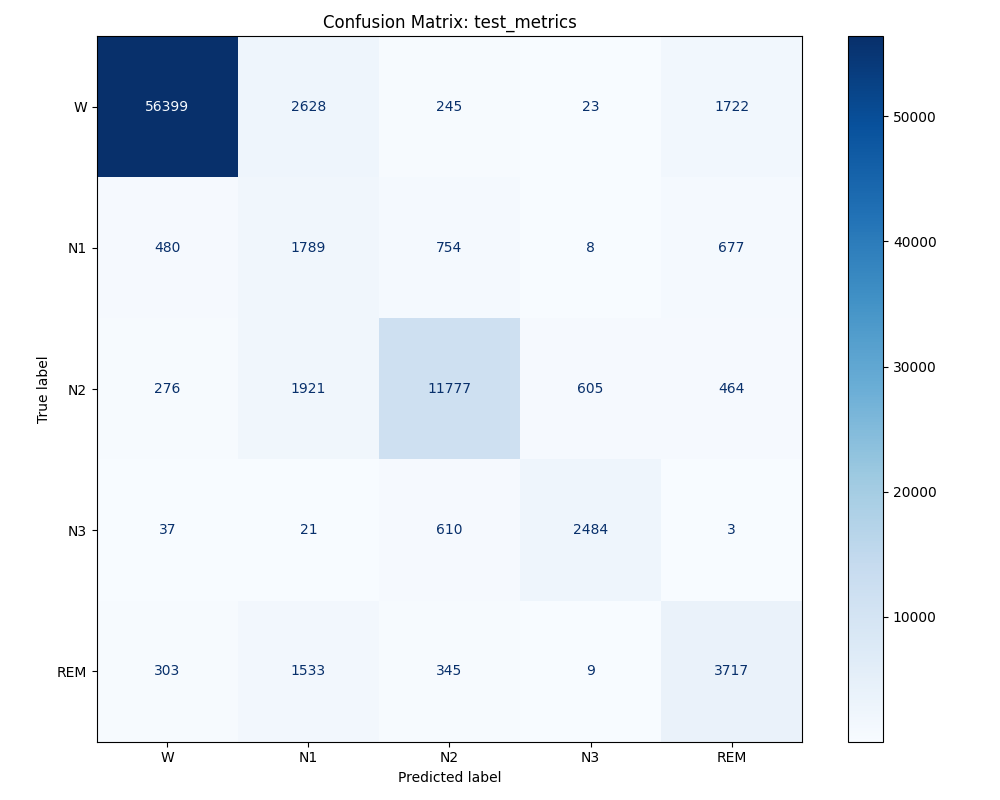

# Sleep Stage Classification from EEG Signals

An end-to-end machine learning (ML) pipeline for classifying sleep stages (Wake, N1, N2, N3, REM) from overnight EEG recordings using the Sleep-EDF dataset.

**Note:** I continue to improve and refine this project from time to time as I learn more about sleep analysis and EEG processing.

**Try the live demo:** https://sleep-stage-classifier-eeg.streamlit.app/.

## Abstract

My interest in sleep research began while working at Corkum LABS at Dalhousie University, a group focused on developing non-invasive treatments for insomnia through e-health applications. While brainstorming project ideas to apply my ML skills, I came across an article from the University of Toronto about combining neuromodulation devices with ML to treat sleep disorders. This inspired me to build a sleep stage classification model.

Using the Sleep-EDF dataset, I built an end-to-end pipeline to classify 30-second EEG epochs into the five standard sleep stages (Wake, N1, N2, N3, REM). Data from the FPz–Cz and Pz–Oz channels was used for signal preprocessing and time and frequency-domain feature engineering.  Strategies to address class imbalance were applied, and a Random Forest classifier with a 60/20/20 train/cross-validation/test split was trained. The model achieved comparable performance with figures reported in prior literature on the test set. This demonstrates strong generalisation. As expected, N1 remained the most difficult stage to differentiate. This project strengthened my practical understanding of developing an ML pipeline and deepened my interest in applying ML to sleep and healthcare applications.

## Dataset

For this project, I used the Sleep-EDF Database Expanded from PhysioNet. It contains 197 whole-night polysomnographic (PSG) recordings, which include EEG, EOG, and EMG signals. All recordings were manually scored by expert sleep technicians according to the Rechtschaffen & Kales standard. Each EEG recording contains signals from two channels: FPz–Cz and Pz–Oz. These are standard and widely used in sleep staging research. The dataset also provides hypnogram files for each PSG recording, containing sleep stage labels (Wake (W), N1, N2, N3, REM) for every 30-second segment of the signal, known as an epoch.

## Methodology

To structure the project clearly, I divided the workflow into four stages. Each stage represents a major component of the pipeline, including subject-wise splitting to create train/validation/test sets, signal preprocessing, feature extraction, and training and evaluating a Random Forest classifier.

### Stage 0: Building the Master Inventory and Train/Cross-Validation/Test Splits

In the initial stage, I first created a master inventory (CSV file) of all available recordings. This involved mapping each subject’s PSG file to its corresponding hypnogram file and extracting metadata such as subject ID, recording duration, and available EEG channels. Each row in this inventory represents a single subject-night recording and contains the PSF and hypnogram file paths, and metadata needed for further processing. After validating and organizing the dataset, this master inventory was used to generate three non-overlapping inventories for the train, cross-validation, and test splits with a 60/20/20 ratio. Each split-level inventory contains the same information as the master inventory, but only for the subject-night recordings assigned to that split.

The splitting was performed at the subject level to prevent data leakage. This ensured that all recordings from the same individual were placed in the same split, which is important because many subjects had multiple nights of data. All three inventories (saved as CSV files in the data/interim directory) served as the foundation for all the following stages.

### Stage 1: Data Loading and Preprocessing

Stage 1 used the subject-level inventories created in Stage 0 to load the correct PSG and hypnogram files for each split. For each entry in a particular split’s inventory, the corresponding PSG file and hypnogram file were loaded. From the PSG recordings, the FPz–Cz and Pz–Oz channels were extracted, after which several preprocessing steps were applied:

#### Key preprocessing steps:

- **Band-pass filter:** A band-pass filter of the range 0.5–30 Hz was used to isolate the main EEG frequency bands used in sleep staging.
- **Epoch segmentation:** The continuous filtered signal was divided into consecutive, non-overlapping 30-second epochs.
- **Label extraction and mapping:** Hypnogram annotations were read using MNE, converted to standardized sleep stage labels (W, N1, N2, N3, REM), and assigned to the corresponding epochs.
- **Epoch filtering:** Epochs without valid labels were removed to maintain dataset quality.
- **Data packaging:** For each subject–night recording, the final set of valid epochs, their labels, channel names, sampling rate, and epoch start times were saved as a compressed .npz file. Additionally, metadata for each epoch was stored in a split-specific CSV file for reference.

The output of this stage was a clean set of .npz files containing labeled 30-second EEG epochs for each split, along with additional metadata. This was the input for feature extraction in Stage 2.

### Stage 2: Feature Engineering and Feature Table Construction

In Stage 2, the preprocessed EEG epochs from Stage 1 are turned into a structured set of features. For each split, every recording (.npz file) was loaded, and a set of time-domain and frequency-domain features was calculated for both EEG channels. These features are common in traditional sleep staging models because they reflect the physiological differences between sleep stages.

#### Time-domain features

These describe the shape and statistical properties of the raw EEG waveform:

- **Mean and Standard Deviation:** Capture the overall amplitude and fluctuation of the signal around its mean. These represent the average EEG voltage during an epoch and the signal's energy or intensity, respectively.
- **Skewness and Kurtosis:** Measures how asymmetric the wave distribution is, which can indicate artifacts (eg, eye blinks).
- **Kurtosis:** Measures the presence of sharp peaks.
- **Zero-Crossing Rate:** Measures how often the wave crosses zero per second. This relates to dominant frequency content and helps distinguish faster rhythms (Wake/REM) from slower ones (N2/N3).
- **Hjorth Parameters (Activity, Mobility, Complexity):** Measure the signal’s shape and dynamics using derivatives.

#### Frequency-domain features

Using Welch’s method, the power spectral density (PSD) was calculated between the range of 0.5 and 30 Hz. This was followed by the extraction of absolute and relative power in standard EEG bands:

- **Delta (0.5–4 Hz):** High delta power indicates deep sleep, which is dominant in N3.
- **Theta (4–8 Hz):** Linked to drowsiness and light sleep, hence stronger in N1 and REM.
- **Alpha (8–12 Hz):** Characteristic of relaxed wakefulness, and present mainly in N1.
- **Sigma (12–15 Hz):** corresponds to sleep spindles, a classic sign of N2.
- **Beta (15–30 Hz):** associated with alertness and cortical activity, hence higher in Wake and REM.
- **Ratios:** Such as Alpha/Theta, Sigma/Theta, Beta/Theta, Beta/Sigma, and Delta/Theta highlight transitions between stages
- **Spectral entropy:** Measures how power is spread across frequencies. Low entropy usually indicates N3, and high entropy is a sign of Wake and REM stages.

For each epoch, these features were combined with metadata (subject ID, night, epoch ID, split, epoch start time, sampling rate, and sleep stage label) into a single row. All rows for a given split were aggregated into a feature table (CSV file). These CSV files were the direct input for the model, which was trained and evaluated in stage 3.

### Stage 3: Modeling, Evaluation, and Refinement

Stage 3 took the feature tables (CSV files) from stage 2 and prepared them for model training and evaluation. The three feature tables (train, cross-validation, test) were loaded, and feature columns were identified and normalised. This ensured that each subject-night recording’s features had a mean ≈ 0 and a standard deviation ≈ 1, preventing the model from learning subject-specific patterns rather than physiological patterns.

After normalisation, the feature matrices (X*”split”) and the corresponding labels (y*”split”) were extracted for each split. A Random Forest classifier was chosen for its robustness on tabular feature sets, its ability to identify nonlinear patterns without requiring extensive tuning, and its quick training time.

A major focus in this stage was addressing the heavy class imbalance, particularly the underrepresentation of N1. Wake dominated most of the recording and was therefore extremely overrepresented. Oversampling strategies, such as Borderline-SMOTE for N1 and standard SMOTE for N2, N3, and REM, were applied to the underrepresented classes to address class imbalance. This was followed by training the Random Forest with class-balanced weights. Different configurations were tested over several iterations, including variations in oversampling strength, filtering, and hyperparameter tuning with RandomizedSearchCV.

Temporal smoothing was then applied to predicted labels to smooth out isolated misclassifications. This filter looks at a small window of continuously predicted labels (for example, the 5 epochs surrounding the current one) and replaces the current prediction with the most common label (mode) in that window.

Model evaluation and improvements were guided by performance on the cross-validation split, using metrics such as accuracy, macro F1, Cohen’s kappa, ROC-AUC, and per-class F1 scores. The confusion matrix and ROC curves helped identify challenges in distinguishing transitional stages such as N1. Once a stable configuration was reached, the model’s final performance was assessed on the test set using the same metrics. The results will be discussed in the next section.

The final output of this stage was a trained Random Forest model, predictions, evaluation metrics, saved parameters, and feature-importance rankings, which helped interpret results.

## Results and Discussion

This section summarises the performance across all iterations of the model, from the baseline version (v0) to the final hyperparameter-tuned model (v4). Each version introduced a unique modification, and both cross-validation (CV) and final test-set results are presented here.

### Version Overview

| Version                                 | Description                                                                                                                                                                                                                                                                                                                                                                                                                       |
| --------------------------------------- | --------------------------------------------------------------------------------------------------------------------------------------------------------------------------------------------------------------------------------------------------------------------------------------------------------------------------------------------------------------------------------------------------------------------------------- |
| **v0: Baseline**                        | A standard baseline Random Forest Classifier using mostly default parameters. Used as the foundation for all later experiments. **Parameters:** `bootstrap=True`, `class_weight="balanced"`, `criterion="gini"`, `max_depth=None`, `max_features="sqrt"`, `min_samples_leaf=1`, `min_samples_split=2`, `n_estimators=100`, `n_jobs=-1`, `random_state=42`.                                                                     |
| **v1: v0 + Oversampling**               | Multiple strategies to handle class imbalance (undersampling and oversampling) were tested. The best results came from aggressive oversampling: **Borderline-SMOTE for N1 (15×)**, and **SMOTE for N2 (2×), N3 (5×), REM (7×)**. All model parameters from v0 were kept the same.                                                                                                                                                 |
| **v2: v1 + Temporal Smoothing (w = 5)** | Added temporal smoothing as a post-processing step. Smoothing replaces each predicted label with the most frequent (mode) label in a surrounding window. Window sizes 3–12 were tested, and 5 performed best. No new model was trained (v1 reused).                                                                                                                                                                               |
| **v3: Hyperparameter Tuning pt. 1**     | A RandomizedSearchCV was attempted but was too slow, so manual hyperparameter tuning was performed instead. **Parameters:** `bootstrap=True`, `class_weight={"0":1.0,"1":3.0,"2":1.0,"3":1.5,"4":2.0}`, `criterion="log_loss"`, `max_depth=25`, `max_features=0.5`, `min_samples_leaf=3`, `min_samples_split=6`, `n_estimators=300`, `n_jobs=-1`, `random_state=42`. Oversampling (v1) and temporal smoothing (v2) applied. |
| **v4: Hyperparameter Tuning pt. 2**     | Second and final round of hyperparameter tuning. **Parameters:** `bootstrap=True`, `class_weight=null`, `criterion="log_loss"`, `max_depth=20`, `max_features=0.5`, `min_samples_leaf=3`, `min_samples_split=6`, `n_estimators=500`, `n_jobs=-1`, `random_state=42`. Oversampling (v1) and temporal smoothing (v2) applied.                                                                                                 |

### Cross-Validation (CV) Results (v0 – v4)

| Version | Accuracy | Macro F1 | Macro AUC | Cohen’s kappa | Log Loss |
| ------- | -------- | -------- | --------- | ------------- | -------- |
| **v0**  | 0.8922   | 0.6886   | 0.9684    | 0.7710        | 0.3355   |
| **v1**  | 0.8750   | 0.7122   | 0.9675    | 0.7483        | 0.3637   |
| **v2**  | 0.8879   | 0.7313   | 0.9675    | 0.7715        | 0.3637   |
| **v3**  | 0.8830   | 0.7326   | 0.9693    | 0.7649        | 0.3328   |
| **v4**  | 0.8867   | 0.7369   | 0.9697    | 0.7707        | 0.3215   |

| Version | Wake (W) | N1     | N2     | N3     | REM    |
| ------- | -------- | ------ | ------ | ------ | ------ |
| **v0**  | 0.9698   | 0.2166 | 0.8384 | 0.8226 | 0.5955 |
| **v1**  | 0.9670   | 0.3924 | 0.8182 | 0.8329 | 0.5508 |
| **v2**  | 0.9718   | 0.4077 | 0.8267 | 0.8173 | 0.6327 |
| **v3**  | 0.9703   | 0.4151 | 0.8187 | 0.8333 | 0.6258 |
| **v4**  | 0.9718   | 0.4259 | 0.8232 | 0.8327 | 0.6308 |

Across versions v0 to v4, the results show that improvements come primarily from addressing class imbalance with SMOTE and stabilising predictions through temporal smoothing. Hyperparameter tuning contributed smaller refinements in later versions. The N1 and REM classes were the most challenging for the model to predict correctly. Improvements in their performance largely dictated gains in overall metrics.

- **v0 to v1:** Macro F1 increased noticeably from 0.69 to 0.71, driven almost entirely by the large improvement in N1 (F1 increasing from 0.22 to 0.39). The aggressive oversampling strategy allowed the model to better represent the minority classes, particularly N1, which is underrepresented and less distinct in its EEG patterns.

- **v2:** Macro F1 further improved from 0.71 to 0.73 because of temporal smoothing. This benefited transitional states such as N1 and the transition from REM to N1. This can be seen in the increase of REM F1 from 0.55 to 0.63, and the continued improvement in N1 from 0.39 to 0.41. Wake, N2, and N3 remained relatively stable across versions since they have more distinct EEG patterns.

- **v3 / v4:** These show small refinements rather than major shifts. Manual hyperparameter tuning slightly increased macro F1 up to 0.7369 and macro AUC up to 0.9697 in v4. Per-class scores followed the same pattern, as N1 continued to increase steadily, reaching 0.43 in v4. The other stages remained strong, with only minor fluctuations. These gradual improvements suggest that once imbalance and prediction consistency were addressed, the Random Forest’s performance reached a ceiling, given the constraints of using only EEG data (without EOG and EMG) and handcrafted features.

Overall, the CV results show a steady progression. Large gains were observed in the early versions from correcting imbalance and stabilising predictions, followed by smaller, meaningful refinements through tuning. Version v4 was the strongest configuration and was used on the test set.

### Final Test Set Results (v0 – v4)

| Metric            | Value  |
| ----------------- | ------ |
| **Accuracy**      | 0.8574 |
| **Macro F1**      | 0.6929 |
| **Macro AUC**     | 0.9614 |
| **Cohen’s kappa** | 0.7255 |
| **Log Loss**      | 0.4002 |
| **Wake (W) F1**   | 0.9518 |
| **N1 F1**         | 0.3084 |
| **N2 F1**         | 0.8186 |
| **N3 F1**         | 0.7906 |
| **REM F1**        | 0.5952 |

The final v4 model generalises well on the held-out test set, with an accuracy of **0.8574**, a macro F1 of **0.6929**, and a Cohen’s kappa of **0.7255**. These results are slightly weaker than those from the cross-validation set but remain consistent with the performance of traditional tree-based models on the Sleep-EDF dataset. This suggests the model did not overfit, despite aggressive oversampling during training. The macro AUC of **0.9614** also shows that the model can clearly distinguish between the classes.

The confusion matrix shows that Wake, N2, and N3 are clearly separated, as seen by strong diagonal patterns. Most errors occur in the lighter, transitional stages. N1 is often misclassified as Wake, N2, or REM, which is expected given its weaker, less distinctive EEG patterns. REM also shows some confusion with Wake and N1 since its EEG is low-amplitude and mixed-frequency, similar to those stages. There is also some confusion with N2, as it falls between light and deep sleep, so borderline epochs may share similar features. N3 is the most distinct and is rarely misclassified.

The per-class results matched the trends seen during development. Wake had a strong F1 of 0.9518, and both N2 and N3 also performed well, which fits their more distinct features. REM had a moderate F1 of 0.5952, as it overlaps with Wake and N1 during transitions. As expected, N1 was the hardest stage to classify, with an F1 of 0.3084. This difficulty aligns with the known properties of N1, since it is a transitional stage and is often confused with Wake and REM when using only EEG data. This is also consistent with prior literature, where N1 F1 scores for traditional ML approaches on Sleep-EDF are usually between 0.20 and 0.35. For example, Fraiwan et al. (2012) reported N1 F1 around 0.28 using SVM-based features, Lajnef et al. (2015) reported around 0.30 with probabilistic models, and Aboalayon et al. (2016) found similar challenges in detecting N1 with EEG-only inputs.

Overall, the test-set results support the trends seen in cross-validation. The majority of performance gains come from handling class imbalance and stabilising predictions. However, it is clear that the Random Forest model hits a ceiling, as it struggles to capture the subtle patterns needed to separate stages like N1 and REM.

## Limitations

There are several limitations of this project. First, it uses only EEG data, whereas full polysomnography includes additional EOG and EMG data that provide useful information about eye movements and muscle tone. These are important for distinguishing challenging stages such as N1 and REM. Relying on EEG data solely naturally limits model performance. Even though thousands of epochs are extracted for each split, the total is only 197 recordings, which means the dataset is relatively small, aggravating the class imbalance issue. Oversampling strategies help, but cannot fully replicate real physiological variability.

Another limitation is that the pipeline depends on handcrafted features. While these features are standard in classical sleep staging, they cannot capture the full complexity of EEG signals as well as modern deep-learning models can, particularly during transitional stages like N1.

Finally, this project was my first time working with EEG data and reflects my ongoing learning in sleep physiology. Although I followed established methods, my understanding in some areas is still developing, and future improvements to the pipeline would likely lead to better performance and generalisation.

## Future Work

There are several ways in which this project can be expanded. A natural next step is to incorporate EOG and EMG signals to improve discrimination between stages.

On the modeling side, experimenting with deep learning models could capture more meaningful patterns in raw EEG data that handcrafted features may miss.

Finally, I plan to refine parts of the pipeline as my understanding of EEG processing and sleep physiology grows.
